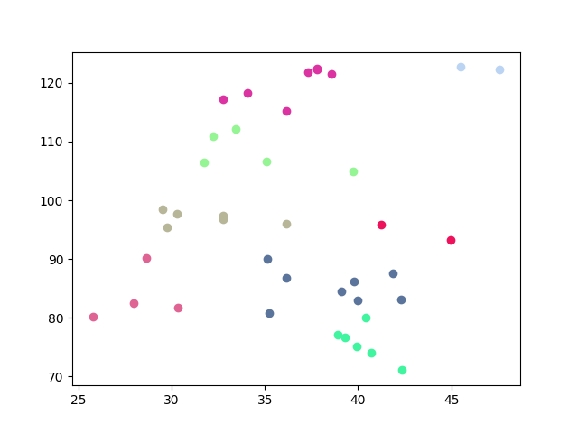

# <vehicle_routing>

This program clusters a large number of cities before using Ocean Suite's LeapHybridSampler to optimise for shortest route through each city in each individual cluster. Another solution for the classic NP complete vehicle routing problem.

TO DO:
* Separate cities, cities_index and cities_lookup into one JSON file to be read into program. 
* Allow user input for starting and ending city for each cluster. 
* Integrate traffic alerts with traffic app API to update routing accordingly. 




## Usage

```bash
python multipleTSP.py
```

## Code Overview

## Code Specifics

Notable parts of the code implementation. (TO DO)

## References

Scikit Learn, "K-Means clustering", [sklearn clustering algorithm](https://scikit-learn.org/stable/modules/generated/sklearn.cluster.KMeans.html)

## License

Released under the Apache License 2.0. See [LICENSE](LICENSE) file.
